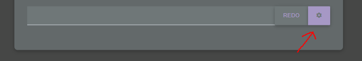

# typing-test

Modern typing test which supports custom themes, redo hotkeys and configurable settings.

## Theme
To change your theme; go to settings (click on the setting icon beside the redo button)

After clicking on the setting icon,you'll see the settings

You can change the themes though here. This is an example of me changing the theme.

## Word length
You can change the word length so that the tester will only give that specific work length.
You can change the word length to only give you "below", "above", and "exact"
a specific length. For example, if you only want words **below 8** words, it will give
**"length of words < 8"**. So if the word length is 8 it will **__not__** be shown or if a word length
is 7 it will **__be shown__**. Another example is if you want words **above 10**, it will give
**length of words > 10**. So if the word length is 9 it will **__not__** be shown or if a word length
is 10 it will **__be__** shown.

## Redo hotkey
You can configure the redo hotkey to anything you like. By default, it is "ALT+R" so if you press
the "R" key while holding alt (or vice-versa). It will reload to a new list of words. However, you
can press the button instead if you prefer it.
